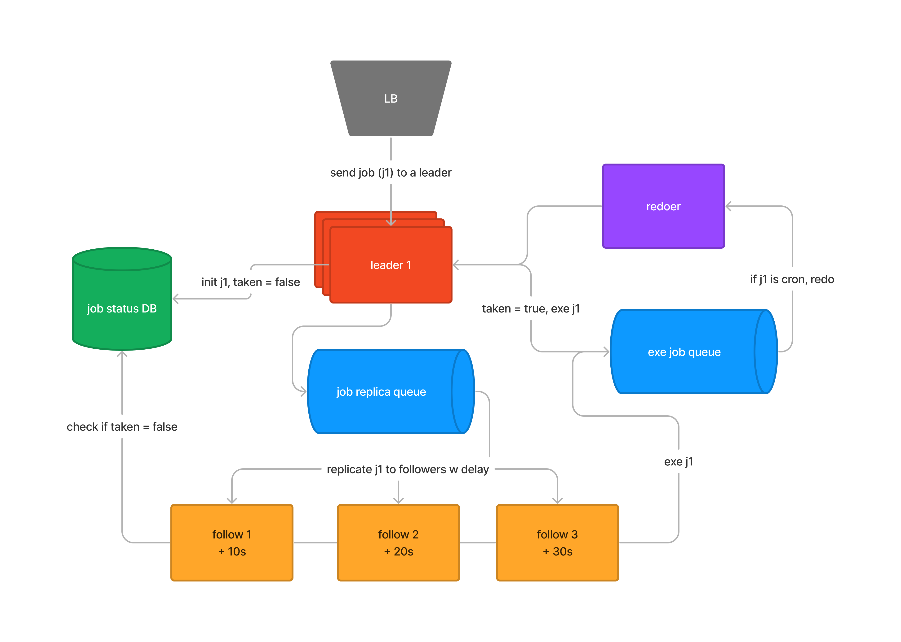

<p align="center">
    
</p>

A high-performance scheduling engine built in Rust. Designed for scalability and efficiency, Flipper is ideal for managing complex scheduling tasks in distributed systems.

## Features 🚀

We use a replicated leader-follower approach for horizontal scale and guaranteed execution with seamless failover.

> Schedule a job using seconds, a Unix timestamp, UTC datetime or cron expression.
>
> ```json
> {"job_id": "0-e0c90c82", "schedule_type": "seconds", "schedule_value": "5"}
> {"job_id": "1-53b570d0", "schedule_type": "timestamp", "schedule_value": "1703345877.875303"}
> {"job_id": "2-4cd895a1", "schedule_type": "datetime", "schedule_value": "2023-12-23T22:37:57.875303+07:00"}
> {"job_id": "3-14dabc8e", "schedule_type": "cron", "schedule_value": "*/10 * * * * *"}
> ```

- **Distributed Architecture**: Optimized for handling scheduling in a distributed environment.
- **High Performance**: Leveraging Rust's performance for handling concurrent tasks efficiently and reliably.
- **Scalable Design**: Containerised services easily scale with your scheduling growing demands.
- **Customizable**: Designed to be drop-in and flexible.

<p align="center">
    
</p>

## Dependencies :package:

- [Rust](https://www.rust-lang.org/) >= 1.7

## Install & Run 🛠️

```bash
docker-compose up
```

## Testing :microscope:

```bash
python test.py
```

<!-- ## ️️ Common Issues and FAQ :pushpin: -->

<!-- <details> -->
<!--     <summary>Toggle Switch</summary> -->
<!--     Foldable Content[enter image description here][1] -->
<!-- </details> -->

## ️️ Upcoming Features :construction:

- [ ] TTL for taken jobs in database

<h2 align="center">Contact</h2>
<p align='center'>
    <a href="mailto:yohanderose@gmail.com?subject=Hello">📧 Email</a>
    <a href="#">👨🏾 Website</a>
    <a href="https://www.buymeacoffee.com/yderose">🍻 Donate</a>
</p>
